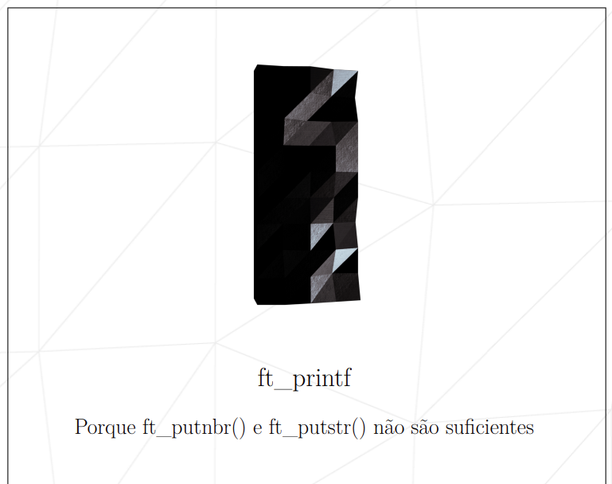
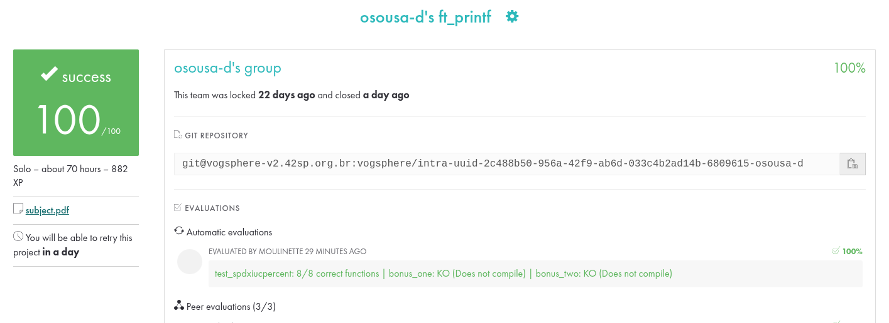

# Ft_printf-42  

📌 **ft_printf**  
O **ft_printf** é um projeto da 42 que tem como objetivo recriar a função `printf` da biblioteca padrão do C.  
Ele permite a formatação e exibição de strings e valores de diferentes tipos, simulando o comportamento da função original.  

---

### 🎯 Objetivo  
- Reimplementar a função `printf` do C, respeitando seu comportamento original.  
- Desenvolver melhor compreensão sobre manipulação de strings, variádicos (`va_list`), organização de código e formatação de saída.  

---

### ✅ Funcionalidades  
O `ft_printf` oferece suporte às seguintes conversões:  

- `%c` → caractere  
- `%s` → string  
- `%p` → ponteiro (endereço de memória em hexadecimal)  
- `%d` / `%i` → números inteiros (decimal)  
- `%u` → inteiro sem sinal (unsigned)  
- `%x` / `%X` → números hexadecimais (minúsculo e maiúsculo)  
- `%%` → imprime o caractere `%`  

---

### 🛠️ Tecnologias  
- Linguagem C  
- Manipulação de argumentos variádicos com `stdarg.h`  
- Organização modular do código  

---

📅 **Período de desenvolvimento**  
- Início: 09/08/2025  
- Término: 02/09/2025  

---

